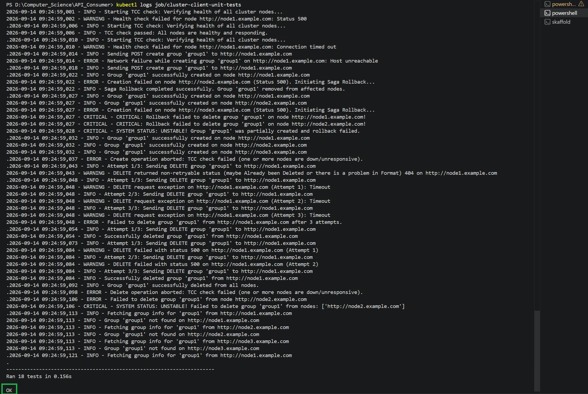
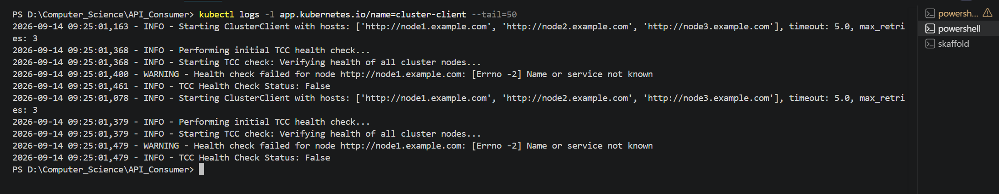

# Robust API-Consumer in Unreliable Environment

A production-ready, fault-tolerant Python API client designed to manage distributed group records across unreliable cluster nodes, fully containerized and deployable on Kubernetes with hardened security practices.

---

## Table of Contents

- [1. Project Overview](#1-project-overview)
  - [Background & Core Problem](#background--core-problem)
  - [Implementation Objective](#implementation-objective)
  - [API Specifications & Architectural Assumptions](#api-specifications--architectural-assumptions)
- [2. Resiliency Strategy for Unreliable Environments](#2-resiliency-strategy-for-unreliable-environments)
  - [Strategy 1: Try-Confirm-Cancel (TCC) Health Check Phase](#strategy-1-try-confirm-cancel-tcc-health-check-phase)
  - [Strategy 2: Create Group (POST) — Saga Pattern with Compensating Transactions](#strategy-2-create-group-post--saga-pattern-with-compensating-transactions)
  - [Strategy 3: Delete Group (DELETE) — Idempotent Retry-to-Target-State](#strategy-3-delete-group-delete--idempotent-retry-to-target-state)
  - [Strategy 4: System UNSTABLE State Handling](#strategy-4-system-unstable-state-handling)
- [3. Test Suite & Verification](#3-test-suite--verification)
  - [Key Features of the Test Suite](#key-features-of-the-test-suite)
- [4. Docker & Kubernetes Architecture](#4-docker--kubernetes-architecture)
  - [Multi-Stage Dockerfile Strategy](#multi-stage-dockerfile-strategy)
  - [Production Security Hardening Highlights](#production-security-hardening-highlights)
  - [Kubernetes Manifests & Components](#kubernetes-manifests--components)
- [5. Execution Guide](#5-execution-guide)
  - [Option 1: Direct Execution in Python Environment](#option-1-direct-execution-in-python-environment)
  - [Option 2: Deployment on Local Kubernetes Cluster (Kind + Skaffold)](#option-2-deployment-on-local-kubernetes-cluster-kind--skaffold)
- [6. Execution & Results Screenshots](#6-execution--results-screenshots)
  - [6.1. Unit Test Job Execution Logs (`kubectl logs job/cluster-client-unit-tests`)](#61-unit-test-job-execution-logs-kubectl-logs-jobcluster-client-unit-tests)
  - [6.2. Client Runner Deployment Logs (`kubectl logs -l app.kubernetes.io/name=cluster-client`)](#62-client-runner-deployment-logs-kubectl-logs--l-appkubernetesionamecluster-client)
- [7. Teardown & Cleanup Guide](#7-teardown--cleanup-guide)
  - [7.1. Stop Skaffold Development Loop](#71-stop-skaffold-development-loop)
  - [7.2. Delete the Kind Kubernetes Cluster](#72-delete-the-kind-kubernetes-cluster)
  - [7.3. Purge Docker Build Cache (Optional)](#73-purge-docker-build-cache-optional)
  - [7.4. Stop Docker Desktop](#74-stop-docker-desktop)


---


## 1. Project Overview

### Background & Core Problem
In distributed cluster environments, managing data consistency across multiple independent nodes is a fundamental challenge. In this project, a cluster consists of several RESTful API nodes (e.g., `http://node1.example.com`, `http://node2.example.com`, `http://node3.example.com`). The client module must execute operations—such as creating or deleting group records—across **all nodes simultaneously**.

However, the underlying network and node infrastructure are inherently **unreliable**:
- Network timeouts, connection drops, and unpredictable `500 Internal Server Error` responses can occur at any point.
- Partial failures across nodes can cause architectural drift and data inconsistency.

### Implementation Objective
The objective of this project is to build a highly reliable client module (`ClusterClient`) in Python using `httpx` that guarantees cluster consistency through distributed transaction patterns (TCC, Saga, and Exponential Backoff Retries). Furthermore, the application is containerized with a hardened multi-stage `Dockerfile` and deployed on Kubernetes using `Kustomize`, `Kind`, and `Skaffold`.

in the api section it is assumped that if the group created before the code is 400 and if the group doesn't exist in get api the return code is 404 but there is no assumption for deletion if node does'nt exist so i assume it is 404 too

### API Specifications & Architectural Assumptions
Based on the technical challenge requirements and API node behavior, the client operates under the following status code specifications and assumptions:
- **`POST /group` (Group Creation)**: Returns `201 Created` upon successful record creation, or `400 Bad Request` if the group record already exists on the target node.
- **`GET /group/{name}` (Group Retrieval)**: Returns `200 OK` with group payload on success, or `404 Not Found` if the requested group does not exist on the node.
- **`DELETE /group/{name}` (Group Deletion)**: While the prompt did not explicitly define the status code when deleting a non-existent group from a node, we assume `404 Not Found` if the group is missing (which is treated as a target state achievement in idempotent deletion), and `200 OK` / `204 No Content` upon successful removal.

---

## 2. Resiliency Strategy for Unreliable Environments

To handle node unreliability and maintain consistency without leaving orphaned data, `ClusterClient` implements a multi-layered transaction and resiliency strategy:

```
                  ┌─────────────────────────────────────┐
                  │ 1. TCC Health Check (check_all_ok)  │
                  └──────────────────┬──────────────────┘
                                     │ Passed
                  ┌──────────────────▼──────────────────┐
                  │   2. Execute Operation Across Nodes │
                  └─────────┬─────────────────┬─────────┘
                            │                 │
              Create (POST) │                 │ Delete (DELETE)
                            ▼                 ▼
          ┌───────────────────┐             ┌─────────────────────┐
          │   Saga Pattern    │             │   Idempotent Retry  │
          │  with Rollback    │             │  Exponential Backoff│
          └─────────┬─────────┘             └─────────┬───────────┘
                    │                                 │
         Rollback   │ Failure              Retries    │ Failure
         Fails      ▼                      Exhausted  ▼
          ┌───────────────────────────────────────────────┐
          │   Flag System Status: "unstable" (Critical)  │
          └───────────────────────────────────────────────┘
```

### Strategy 1: Try-Confirm-Cancel (TCC) Health Check Phase
Before attempting any state-changing operation (`create_group` or `delete_group`), the client executes a TCC Phase 1 health check (`check_all_nodes_ok`).
- The client sends a lightweight `GET` request to every node in the cluster.
- If any node is unreachable or responds with an HTTP status $\ge 500$, the entire operation is **aborted early** before modifying any node state.

### Strategy 2: Create Group (POST) — Saga Pattern with Compensating Transactions
Creating a group requires sending HTTP `POST` requests sequentially across all nodes.
- **Normal Execution**: If all nodes return `201 Created` (or acceptable non-error codes), the creation succeeds cluster-wide.
- **Failure & Compensating Rollback**: If creation fails on any single node (due to a 500 error, timeout, or network exception), the transaction halts immediately. The client triggers a **Saga Rollback**, issuing compensating `DELETE` requests with retries to all previously created nodes to erase partial state and restore cluster consistency.

### Strategy 3: Delete Group (DELETE) — Idempotent Retry-to-Target-State
HTTP `DELETE` is inherently idempotent.
- When deleting a group across the cluster, if a node fails or times out mid-execution, the client uses `delete_group_on_node_with_retry`.
- The client retries the `DELETE` request up to `MAX_RETRIES` with an exponential backoff delay (`retry_backoff`).
- Client errors such as `404 Not Found` are treated as non-retryable successes (target state achieved).

### Strategy 4: System UNSTABLE State Handling
If a Saga Rollback fails to delete a partially created group from a node, or if a `DELETE` operation exhausts all retry attempts on a node:
- The system returns an explicit status of `"unstable"`.
- A critical alert is logged with details of affected/remaining nodes, signaling the need for operational monitoring or manual intervention.

---

## 3. Test Suite & Verification

The project includes a comprehensive test suite in `test_client.py` built with Python's standard `unittest` framework and `unittest.mock`. 

### Key Features of the Test Suite
- **100% Mocked Network Dependencies**: Uses `@patch.object(httpx.Client, ...)` to simulate all HTTP status codes (201, 200, 400, 404, 500) and network exceptions (`httpx.TimeoutException`, `httpx.RequestError`) without requiring live external services.
- **18 Isolated Unit Tests** covering all operational pathways:

| Test Group | Test Case | Scenario Tested |
| :--- | :--- | :--- |
| **TCC Health Check** | `test_check_all_nodes_ok_success` | Returns `True` when all nodes respond with status < 500. |
| | `test_check_all_nodes_ok_server_error` | Returns `False` immediately if any node returns status $\ge 500$. |
| | `test_check_all_nodes_ok_timeout` | Returns `False` on network timeout. |
| **Single-Node Create** | `test_create_group_on_node_success` | Verifies POST payload and handles `201 Created`. |
| | `test_create_group_on_node_network_failure` | Returns `None` on network connection error. |
| **Retry Mechanism** | `test_delete_group_on_node_with_retry_success` | Succeeds on attempt 1. |
| | `test_delete_group_on_node_with_retry_client_error_no_retry` | Non-500 errors (e.g. 404) are not retried. |
| | `test_delete_group_on_node_with_retry_success_after_retries` | Retries on 500 errors and succeeds on attempt 3. |
| | `test_delete_group_on_node_with_retry_exhausted` | Returns `None` after exhausting `max_retries`. |
| **Saga & Rollback** | `test_create_group_tcc_failed` | Aborts creation if TCC health check fails. |
| | `test_create_group_success_all_nodes` | Successfully creates group on all nodes. |
| | `test_create_group_saga_rollback_success` | Node 2 fails; Saga rollback deletes group from Node 1. |
| | `test_create_group_saga_rollback_unstable` | Node 2 fails & rollback on Node 1 fails $\rightarrow$ returns `unstable`. |
| **Delete & Get Operations** | `test_delete_group_tcc_failed` | Aborts delete if TCC health check fails. |
| | `test_delete_group_success` | Successfully deletes group from all cluster nodes. |
| | `test_delete_group_unstable` | Retries exhausted on one node $\rightarrow$ returns `unstable`. |
| | `test_get_group_success` | Retrieves group metadata from an active node. |
| | `test_get_group_not_found` | Returns `not_found` when group is missing on all nodes. |

---

## 4. Docker & Kubernetes Architecture

### Multi-Stage Dockerfile Strategy
To achieve a lightweight, production-hardened container image, a two-stage build architecture is used:

```dockerfile
# Stage 1: Builder Stage
FROM python:3.12-slim AS builder
WORKDIR /app
ENV PYTHONDONTWRITEBYTECODE=1 PYTHONUNBUFFERED=1
RUN python -m venv /opt/venv
ENV PATH="/opt/venv/bin:$PATH"
COPY requirements.txt .
RUN pip install --no-cache-dir -r requirements.txt

# Stage 2: Production Hardened Runtime
FROM python:3.12-slim AS runner
WORKDIR /app
ENV PYTHONDONTWRITEBYTECODE=1 PYTHONUNBUFFERED=1 PATH="/opt/venv/bin:$PATH"
COPY --from=builder /opt/venv /opt/venv

# Security: Non-Root User & Group (UID/GID 10001)
RUN groupadd -g 10001 appgroup && \
    useradd -u 10001 -g appgroup -s /bin/sh appuser && \
    chown -R appuser:appgroup /app

COPY --chown=appuser:appgroup client.py .
COPY --chown=appuser:appgroup test_client.py .
COPY --chown=appuser:appgroup main.py .

USER 10001:10001
CMD ["python", "main.py"]
```

### Production Security Hardening Highlights
1. **Non-Root Execution**: Runs under UID/GID `10001` (`appuser`) adhering to the Principle of Least Privilege.
2. **Read-Only Root Filesystem**: `readOnlyRootFilesystem: true` prevents unauthorized filesystem modifications. A temporary `emptyDir` volume is mounted at `/tmp` for temporary files.
3. **Capability Drop & Seccomp**: All Linux capabilities are dropped (`capabilities: drop: - ALL`) and standard Seccomp profiling is enabled (`seccompProfile: type: RuntimeDefault`).
4. **Network Isolation (`NetworkPolicy`)**: Restricts egress traffic exclusively to UDP Port 53 (CoreDNS) and TCP Ports 80/443 (HTTP/HTTPS API endpoints), blocking lateral movement.

### Kubernetes Manifests & Components

```text
manifests/base/
├── configmap.yaml       # Externalized cluster config (CLUSTER_HOSTS, CLIENT_TIMEOUT, MAX_RETRIES)
├── deployment.yaml      # 2-replica Client Runner with strict CPU/Memory resource requests/limits
├── job-test.yaml        # Automated K8s Job for running unit tests on container startup
├── networkpolicy.yaml   # Egress firewall rules for container network isolation
└── kustomization.yaml   # Kustomize manifest bundle
```

---

## 5. Execution Guide

### Option 1: Direct Execution in Python Environment

#### 1. Install Dependencies
```bash
pip install -r requirements.txt
```

#### 2. Run Unit Tests (18 Tests)
```bash
python -m unittest test_client.py
```

#### 3. Python Usage Example
```python
from client import ClusterClient

hosts = [
    "http://node1.example.com",
    "http://node2.example.com",
    "http://node3.example.com"
]

# Utilize Context Manager for automatic connection cleanup
with ClusterClient(hosts=hosts, timeout=5.0, max_retries=3) as client:
    # 1. Create group across all nodes (TCC + Saga Rollback)
    res_create = client.create_group("engineering-team")
    print("Create Status:", res_create["status"])

    # 2. Retrieve group details
    res_get = client.get_group("engineering-team")
    print("Group Details:", res_get)

    # 3. Delete group across cluster with Retry logic
    res_delete = client.delete_group("engineering-team")
    print("Delete Status:", res_delete["status"])
```

---

### Option 2: Deployment on Local Kubernetes Cluster (Kind + Skaffold)

#### 1. Create Local Kind Cluster
```bash
kind create cluster --config kind-config.yaml
```

#### 2. Verify Node Status
```bash
kubectl get nodes
```

#### 3. Deploy with Skaffold
> **Note:** If you encounter any installation or environment setup issues with Skaffold, feel free to consult AI assistants (such as ChatGPT, Claude, or Gemini) for quick troubleshooting. Rest assured that the application codebase and Kubernetes manifests provided in this repository are verified and fully functional.

```bash
skaffold dev --status-check=false

---


#### 4. Verify Pod Status and Logs
```bash
# Check Pods (Unit tests pod Completed, Client deployment pods Running)
kubectl get pods

# View unit tests execution logs
kubectl logs job/cluster-client-unit-tests

# View client runner logs
kubectl logs -l app.kubernetes.io/name=cluster-client --tail=50
```

---


## 6. Execution & Results Screenshots

This section highlights the successful execution of both the automated **Unit Test Job** (`cluster-client-unit-tests`) and the **Client Deployment Pods** (`cluster-client`) running on the local Kubernetes cluster.

### 6.1. Unit Test Job Execution Logs (`kubectl logs job/cluster-client-unit-tests`)

When the Kubernetes Job is launched by Skaffold, all 18 unit tests are executed automatically inside an isolated, read-only container environment:




### 6.2. Client Runner Deployment Logs (`kubectl logs -l app.kubernetes.io/name=cluster-client`)

The 2-replica Deployment pods execute the main client loop (`main.py`), periodically interacting with the cluster hosts and logging transaction results:



> This log output is produced by the client deployment pods running `main.py`. Upon container startup, the client immediately performs an initial health check across all target nodes (`check_all_nodes_ok`). Because the configured dummy node endpoints (`http://node1.example.com`, etc.) do not exist in the local network DNS, the client encounters a `[Errno -2] Name or service not known` resolution error during the health check. Rather than crashing or failing unhandled, the application gracefully catches the exception, logs a warning, and sets the TCC status to `False`, thereby aborting any further state-modifying requests. This behavior **demonstrates that the Try-Confirm-Cancel (TCC) pattern is functioning exactly as designed**. Instead of blindly attempting state mutations (`POST` / `DELETE`) on unreachable nodes, the client safely aborts the transaction early, preventing partial cluster writes and maintaining data integrity across unreliable infrastructure.


---


## 7. Teardown & Cleanup Guide

To stop the running application, tear down the local Kubernetes cluster, and free up system resources (CPU and Memory):

### 7.1. Stop Skaffold Development Loop
If `skaffold dev` is actively running in your terminal window:
- Press **`Ctrl + C`** in the terminal window.
- Skaffold will automatically clean up deployed Kubernetes manifests, services, and pods before exiting.

### 7.2. Delete the Kind Kubernetes Cluster
To remove the local Kind cluster (`cluster-client-cluster`) and free up system RAM:
```bash
kind delete cluster --name cluster-client-cluster
```

### 7.3. Purge Docker Build Cache (Optional)
To clear unused Docker build caches and temporary container layers:
```bash
docker system prune -f
```

### 7.4. Stop Docker Desktop
If you no longer require the Docker daemon:
- Right-click the Docker Desktop whale icon in the System Tray / Menu Bar.
- Select **Quit Docker Desktop**.
